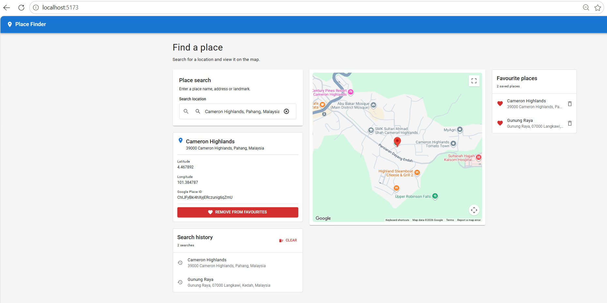

# Place Finder for Maybank Malaysia

The old version was just this https://github.com/github1001/Autocomplete

A full-stack place-search application built with React, Redux Toolkit, Google Maps and Spring Boot.

Users can search for a location through Google Place Autocomplete, view it on a map, review their search history and save selected places as favourites in Microsoft SQL Server.



## Demo


## Main Features

- Google Place Autocomplete
- Google Maps place display
- Redux search-history management
- Redux Thunk asynchronous actions
- Material UI responsive layout
- Favourite-place persistence
- Spring Boot REST API
- Microsoft SQL Server database
- Validation and duplicate handling
- Backend connection error handling

## Architecture

```text
React + TypeScript
        ↓
Redux Toolkit + Redux Thunk
        ↓
Axios
        ↓
Spring Boot REST API
        ↓
Spring Data JPA
        ↓
Microsoft SQL Server
```

## Repository Structure

```text
place-finder
├── backend
├── demo
├── frontend
├── .gitignore
└── README.md
```

## Running the Application

### 1. Start SQL Server

Ensure SQL Server is running and listening on TCP port `1433`.

### 2. Start the backend

```powershell
cd backend

$env:DB_USERNAME="placefinder"
$env:DB_PASSWORD="your_password"

mvn spring-boot:run
```

Backend:

```text
http://localhost:8080
```

### 3. Start the frontend

Open another terminal:

```powershell
cd frontend
copy .env.example .env
npm install
npm run dev
```

Frontend:

```text
http://localhost:5173
```

See the individual frontend and backend README files for complete setup instructions.

---
